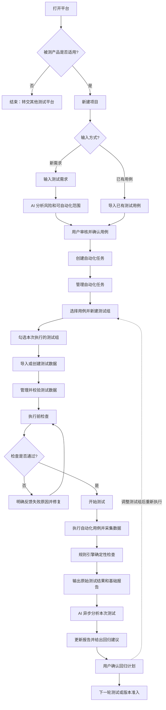

# 平台设计结论

本文汇总项目讨论后形成的产品范围、用户流程和技术架构结论。它用于统一后续开发计划、流程图和面试表达；规划内容不等于已经实现，是否完成仍以代码、测试和验收产物为准。

## 1. 项目定位

本项目当前定位为：

> 面向多传感器采集设备的测试执行与诊断 POC，先用可重复的模拟/导入数据验证测试流程、确定性检查、报告和 AI 辅助诊断，再逐步接入模拟设备和真实设备。

当前没有实体被测设备，因此开发和演示以模拟数据、模拟设备和离线自动化测试为主，不伪装成已经完成真实硬件联调。

## 2. 版本边界

| 版本 | 目标 | 主要模块 | 状态 |
| --- | --- | --- | --- |
| v0.1.0 | 基础测试执行与诊断 POC | 合成/导入数据、确定性检查、时间对齐、基础报告、Mock AI、CI 骨架 | 当前基础能力 |
| v0.2.0 | 项目管理、完整报告与准入规则 | 项目、用例、测试组、数据资产、趋势图、版本对比、质量门禁 | 规划中 |
| v0.3.0 | AI 测试前分析 | 需求结构化、风险分析、自动化范围识别、用例和回归建议 | 规划中 |
| v0.4.0 | 用例驱动的模拟设备执行 | 模拟设备状态机、能力注册、ADB/HTTP/Shell 适配器 | 规划中 |
| v0.5.0 | 音频与多模态分析 | 音频采集、音频质量检查、跨模态事件和关联证据 | 规划中 |
| v1.0.0 | 真实设备与企业级准入 | 真实设备适配、self-hosted runner、GitHub Actions/Jenkins、回归和正式准入 | 规划中 |

v0.1.0 已有的是“数据生成/导入 → 确定性检查 → 基础报告 → 运行后 AI 诊断”的基础闭环，不包含测试前 AI 用例推荐、设备控制、音频采集、完整报告体系或企业级版本准入。

## 3. 用户视角目标流程



流程中的关键原则：

- 新需求和已有用例是两个入口，最后汇合到自动化任务。
- AI 推荐后必须由用户审核确认，不能直接执行。
- 环境检查失败要返回具体原因和修复建议。
- 确定性结果和基础报告先生成，AI 诊断异步执行且不能阻断原始结果。
- 回归建议必须能回到测试组或回归计划，形成下一轮执行闭环。

## 4. 模拟数据如何执行自动化用例

当前 v0.1.0 是“数据驱动型自动化”：

```text
任务配置
  → 模拟数据生成器生成视频、IMU、资源和日志
  → Pytest/API 启动运行任务
  → 检查器读取文件并计算事实
  → 输出检查结果、对齐结果和报告
```

这已经是自动化测试，但测试对象是数据采集结果，不是实体设备。

v0.4.0 计划升级为“用例驱动型模拟设备自动化”：

```text
声明式测试用例
  → 用例执行器读取步骤
  → 调用统一设备能力接口
  → ADB/HTTP/Shell 适配器访问模拟设备
  → 模拟设备改变状态并返回结果
  → 生成对应的视频、IMU、音频、日志和资源事件
  → Pytest 断言和规则检查
  → 报告
```

设计要求是：用例描述要做什么，能力接口描述如何操作，模拟设备状态模型描述设备如何反应，数据生成器根据状态和事件生成证据。

## 5. 用例、能力和状态模型

### 5.1 用例不硬编码设备细节

用例应使用 YAML/JSON 等声明式格式，包含：

- 前置条件。
- 执行步骤、参数、超时和重试策略。
- 预期状态和断言。
- 需要采集的证据。
- 用例版本、标签和所属测试组。

示例：

```yaml
name: 设备启动后检查基础状态
preconditions:
  power: powered_off
steps:
  - action: device.power_on
    timeout_seconds: 10
  - action: device.wait_for
    args: {state: online, timeout_seconds: 20}
  - action: device.get_battery
  - action: device.get_storage
assertions:
  - {field: connection, equals: adb_online}
  - {field: battery_percent, greater_than_or_equal: 20}
```

### 5.2 能力注册

能力是可复用的设备操作，例如：

```text
device.get_state
device.power_on
device.reboot
device.power_off
device.get_battery
device.get_storage
device.get_firmware_version
capture.start
capture.stop
sensor.get_status
fault.inject_video_drop
fault.inject_imu_gap
```

每个能力都要定义名称、参数 Schema、前置条件、状态变化、返回结果、日志事件和失败类型。新增能力时增加独立模块，不修改主执行器。

### 5.3 组合状态模型

模拟设备不应只有几个固定状态，而应由多个属性组成：

```text
power=on
connection=adb_online
capture_service=running
recording=active
battery_percent=85
storage_free_mb=4096
firmware_version=1.2.0
network=connected
```

操作会改变多个关联属性。例如关机后，电源变为 off、ADB 变为 offline、录制停止并写入关机日志；存储不足时，录制提前停止、资源指标下降并产生异常日志。

## 6. 环境检查反馈

环境检查必须返回可操作的失败信息，而不是笼统的“检查失败”。至少包含错误编码、失败对象、实际值、期望值、修复建议和重新检查入口。

| 类别 | 反馈示例 | 修复动作 |
| --- | --- | --- |
| 连接 | 设备未连接、ADB 未授权、HTTP 超时 | 连接设备、授权或检查网络 |
| 状态 | 设备版本不匹配、存储不足、服务未启动 | 更换设备、清理空间或启动服务 |
| 配置 | 测试组为空、用例参数缺失、阈值不完整 | 修改测试组或补齐配置 |
| 数据 | 缺少 IMU、视频编码错误、CSV 字段不完整 | 重新导入或生成数据 |
| 依赖/权限 | FFmpeg 不可用、目录无写权限、命令不在白名单 | 修复依赖、权限或安全配置 |

## 7. 多模态数据格式

| 模态 | 首选格式 | 后续兼容格式 |
| --- | --- | --- |
| 视频 | MP4/H.264 | MKV/H.264、H.265 |
| IMU | CSV | JSONL、Parquet、MCAP |
| 音频 | WAV/PCM | FLAC、AAC、Opus |
| 设备日志 | JSONL | 纯文本、CSV |
| 资源指标 | CSV | JSONL、Prometheus |
| 事件元数据 | JSON | YAML、SQLite |
| 多传感器容器 | MCAP | rosbag2 |

当前 v0.1.0 支持视频 MP4/MKV、IMU CSV/JSONL、设备状态 CSV、设备日志和 JSON 元数据；音频、MCAP 和更复杂的多模态容器属于后续版本。

## 8. GitHub Actions 与测试执行位置

GitHub Actions 不是唯一的测试执行地点，而是 CI 调度和结果汇总入口。

当前 v0.1.0：

```text
GitHub Actions ubuntu-latest
  → 执行 Pytest、Mock 验收、前端检查和安全扫描
  → 生成 JSON/CSV/HTML/Allure/ZIP 产物
  → 上传 Actions artifacts
```

当前不会连接真实设备，也不会把设备测试结果回传到平台。

未来真实设备或局域网模拟设备：

```text
GitHub Actions
  → 调度 self-hosted runner 或设备测试 Agent
  → Agent 执行用例并通过 ADB/HTTP/Shell 控制设备
  → 采集数据、日志和结构化结果
  → 上传证据包
  → 报告服务汇总并执行质量门禁
```

纯数据测试可以使用 GitHub-hosted runner；需要访问设备、内网或专用采集环境时，应使用 self-hosted runner 或本地 Agent。

## 9. 当前与后续开发顺序

1. 定义项目、测试用例、自动化任务、测试组和测试运行的数据契约。
2. 实现用例 Schema、能力注册机制和测试组管理。
3. 实现模拟设备内核、组合状态模型、虚拟时间和事件记录。
4. 接入 ADB、HTTP、Shell 模拟适配器和统一执行器。
5. 让设备状态和事件驱动视频、IMU、音频、资源和日志生成。
6. 接入 Pytest 断言、证据包、报告和失败反馈。
7. 增加 AI 测试前风险分析、用例推荐和回归建议。
8. 最后再接入真实设备、self-hosted runner、Jenkins 和正式版本准入。

