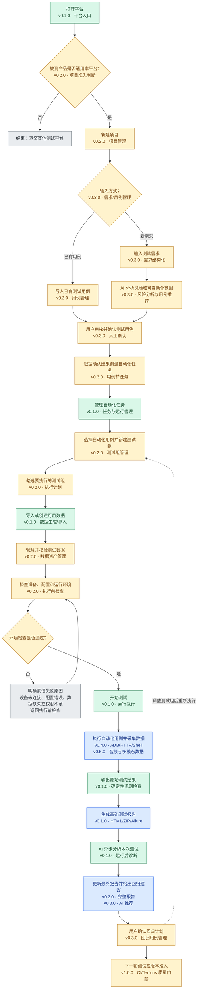

# 用户视角使用流程与版本对应关系

本文从测试工程师的操作角度描述平台的目标使用流程，并标注每个环节预计由哪个版本、哪个功能模块负责。
其中绿色节点是 v0.1.0 已有的基础能力，黄色节点是后续版本规划。

## 一、用户视角端到端流程图



## 二、流程节点对应版本和模块

| 用户操作 | 对应模块 | 版本 | 当前状态 |
| --- | --- | --- | --- |
| 提出测试需求 | 测试需求结构化 | v0.3.0 | 规划中；当前由用户直接配置任务 |
| AI 分析风险 | AI 测试分析 | v0.3.0 | 未实现 |
| 推荐并确认测试用例 | AI 用例推荐 | v0.3.0 | 未实现 |
| 导入已有测试用例 | 测试用例管理 | v0.2.0 | 未实现 |
| 新建项目 | 项目管理和适用性判断 | v0.2.0 | 未实现 |
| 创建或导入测试任务 | 任务管理、导入校验 | v0.1.0 | 已完成基础能力 |
| 选择场景和测试参数 | 合成数据配置 | v0.1.0 | 已完成 |
| 调度测试任务 | 运行队列、Pytest/API 测试 | v0.1.0 | 已完成基础调度；不是设备用例调度 |
| 创建和勾选测试组 | 测试组和执行计划 | v0.2.0 | 未实现 |
| 控制模拟设备 | 设备控制适配器 | v0.4.0 | 未实现 |
| 控制真实设备 | 真实设备适配器 | v1.0.0 | 未实现 |
| 采集视频、IMU、资源和日志 | 合成/导入数据与采集证据 | v0.1.0 | 已完成合成和导入；不接真实设备 |
| 采集音频 | 音频采集适配器 | v0.5.0 | 未实现 |
| 执行确定性检查 | 视频、IMU、存储、资源和日志检查器 | v0.1.0 | 已完成 |
| 执行时间对齐和跨模态关联 | 固定偏移、线性漂移、锚点分析 | v0.1.0 | 已完成基础能力 |
| 执行前检查设备、配置和数据 | 执行前检查 | v0.2.0 | 未实现完整版本 |
| AI 聚合异常并给出诊断 | 证据包、Mock/硅基流动诊断 | v0.1.0 | 已完成；仅运行后诊断 |
| 人工复核测试结果 | 人工检查结果 | v0.1.0 | 已完成 |
| 查看基础报告和证据 | HTML、ZIP、Allure | v0.1.0 | 已完成基础能力；AI 失败不阻断 |
| 查看完整趋势和版本对比 | 报告分析模块 | v0.2.0 | 未实现 |
| AI 给出回归测试建议 | 回归用例推荐 | v0.3.0 | 未实现 |
| 执行质量门禁 | 准入规则和失败阻断 | v0.2.0 | 未实现完整版本 |
| 运行 CI 流程 | GitHub Actions CI 骨架 | v0.1.0 | 已配置基础骨架 |
| 企业级 CI 和 Jenkins | 企业 CI/CD 与版本准入 | v1.0.0 | 未实现 |

## 三、环境检查失败时的反馈

环境检查不能只返回“检查失败”，需要告诉用户失败对象、具体原因和处理建议：

| 检查类别 | 具体反馈示例 | 用户处理动作 |
| --- | --- | --- |
| 设备连接 | `设备未连接`、`ADB 未授权`、`HTTP 健康检查超时` | 重新连接设备、授权或检查网络 |
| 设备状态 | `设备版本不匹配`、`设备存储不足`、`采集服务未启动` | 更换设备、清理空间或启动服务 |
| 任务配置 | `测试组为空`、`用例缺少执行参数`、`阈值配置不完整` | 修改测试组或补齐配置 |
| 测试数据 | `缺少 IMU 文件`、`视频编码不是 H.264`、`CSV 字段不完整` | 重新导入或重新生成数据 |
| 权限和依赖 | `Shell 命令不在白名单`、`FFmpeg 不可用`、`目录无写权限` | 修复权限、安装依赖或更换安全命令 |

反馈结果至少应包含：错误编码、失败对象、检测到的实际值、期望值、修复建议和重新检查按钮。

## 四、多模态数据格式建议

“多模态”既包括不同的数据类型，也包括每种数据类型的文件格式。建议按“首选格式 + 兼容格式”设计：

| 模态 | 首选格式 | 可兼容格式 | 主要检查内容 |
| --- | --- | --- | --- |
| 视频 | MP4/H.264 | MKV/H.264、后续可扩展 H.265 | 编码、帧率、时长、掉帧、坏帧和时间戳 |
| IMU | CSV | JSONL、后续可扩展 Parquet/MCAP | 采样率、丢样、重复、倒退、间隔和六轴字段 |
| 音频 | WAV/PCM | FLAC、AAC、Opus | 采样率、声道、静音、削波、断续和噪声 |
| 设备日志 | JSONL | 纯文本日志、CSV | 时间、级别、模块、事件和错误码 |
| 资源指标 | CSV | JSONL、Prometheus 时序格式 | CPU、内存、温度、存储、电量和网络指标 |
| 事件与元数据 | JSON | YAML、SQLite | 设备版本、测试配置、事件标签和故障真值 |
| 多传感器容器 | MCAP | 后续可兼容 rosbag2 | 多通道消息、时间戳和统一回放 |

当前 v0.1.0 已支持视频 MP4/MKV、IMU CSV/JSONL、设备状态 CSV、设备日志和 JSON 元数据；音频、MCAP 和
更复杂的多模态容器属于后续版本。建议 v0.5.0 先实现 WAV/PCM 与 FLAC，再考虑 AAC/Opus 和 MCAP。

## 五、当前 v0.1.0 用户可走通的流程

```text
创建任务或导入数据
  → 选择场景和参数
  → 运行任务
  → 生成/读取视频、IMU、资源和日志
  → 执行确定性检查
  → 查看时间对齐和异常结果
  → 按需生成 Mock 或真实适配器诊断
  → 人工复核
  → 导出基础 HTML/ZIP 报告
```

当前流程的关键限制：

- 用户需要自己选择测试场景，系统不会在测试前自动分析需求或推荐用例。
- 平台生成或导入测试数据，但不会通过 ADB、HTTP、Shell 控制设备。
- 当前采集链路覆盖视频、IMU、设备状态和日志，不包含音频。
- 报告和 GitHub Actions 已有可运行基础，但还不是完整企业级质量门禁。

## 六、自动化用例、GitHub Actions 与报告的关系

最终执行自动化用例不一定都放在 GitHub 上运行，应该根据被测对象分为两类：

```text
纯数据/模拟测试
  → GitHub-hosted runner 执行 Pytest 和数据生成器
  → 生成 JSON/CSV/HTML/Allure/ZIP 产物
  → 上传 GitHub Actions artifacts
  → 报告页面或报告服务读取并汇总

真实设备/局域网模拟设备
  → self-hosted runner 或设备测试 Agent 执行自动化用例
  → Agent 通过 ADB/HTTP/Shell 控制设备并采集数据
  → 上传结构化结果、日志和受保护的证据包
  → 报告服务生成报告并执行质量门禁
```

当前 v0.1.0 的 GitHub Actions 只运行 `ubuntu-latest` 上的后端、前端、Mock 验收和安全扫描，
不会连接真实设备，也不会把设备测试结果从 GitHub 回传到平台。后续 v0.4.0 可以增加 self-hosted runner 或
本地 Agent，v1.0.0 再把结果回传、报告生成和版本准入正式串起来。

## 七、目标版本的完整用户体验

```text
v0.3.0：用户输入需求
  → AI 分析风险并推荐用例
  → 用户确认测试计划

v0.4.0：测试计划
  → ADB/HTTP/Shell 控制模拟设备
  → 自动执行测试步骤并采集证据

v0.5.0：视频、IMU、音频、日志、资源
  → 多模态对齐和异常关联

v1.0.0：报告和历史回归结果
  → GitHub Actions/Jenkins 质量门禁
  → 通过则准入，失败则阻断并进入复测/修复流程
```
