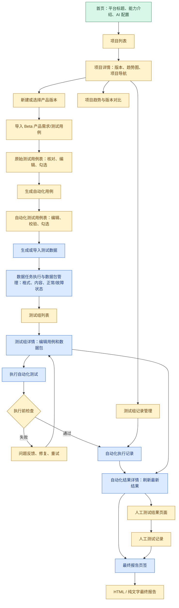

# v0.2.0 前端页面与操作流程

本文供 v0.2.0 前端设计使用。它描述当前已经确认的页面结构、页面之间的跳转关系、按钮和关键状态。

文档中的“当前已有”表示代码中已经存在的 v0.1.0 页面或操作；“v0.2.0 设计”表示已经确认、但当前代码尚未完成的页面或按钮。
这不是业务代码实现清单，页面上线前仍需以实际接口和验收结果为准。

## 1. v0.2.0 页面总流程

## 2. 页面状态和导航原则

### 2.1 页面状态

| 标记 | 含义 |
| --- | --- |
| 当前已有 | v0.1.0 代码已有相关页面或按钮，但不代表已经满足 v0.2.0 设计 |
| v0.2.0 设计 | 本版本需要设计和实现的页面或操作 |
| 后续版本 | v0.3.0、v0.4.0 或更后版本，不在本版本实现 |

### 2.2 导航原则

- 首页保持简洁，只展示平台标题、平台能力说明、适用产品说明和 AI 配置入口，不展示运行统计和趋势图。
- 首页点击“开启”后进入项目列表；项目列表是平台的主要工作入口。
- 点击项目进入二级项目详情；项目详情展示产品版本、已经运行的趋势图和项目内部导航。
- 导入 Beta 产品需求或测试用例、生成自动化用例、管理数据和执行测试按页面顺序推进。
- 测试组的完整管理放在测试组详情二级页面，不把所有用例、数据和历史记录堆在创建弹窗中。
- “执行自动化测试”只执行自动化用例；人工测试通过独立页面录入。
- 最终报告页面只负责选择记录、生成和下载报告，不负责编辑人工结果。
- 所有删除操作先显示影响范围并让用户确认，不强制使用归档代替删除。

## 3. 首页 / 平台介绍与 AI 配置页

**页面目的**：用简洁的首屏说明平台是什么、能做什么、服务哪些产品，并让用户配置和开启 AI。

页面不承担项目统计、趋势分析或运行记录管理，避免首页变成后台看板。

| 元素 | 类型 | 状态 | 说明 |
| --- | --- | --- | --- |
| 平台标题 | 首屏标题 | v0.2.0 设计 | 使用最大的视觉层级，只保留平台名称和一句定位 |
| 平台可以做什么 | 介绍区 | v0.2.0 设计 | 说明数据生成/导入、自动化测试、人工结果汇总和报告分析 |
| 核心能力 | 介绍区 | v0.2.0 设计 | 说明数据驱动模拟、确定性检查、模块化报告和 AI 辅助分析 |
| 适用产品 | 介绍区 | v0.2.0 设计 | 说明面向多传感器采集设备等硬件产品 |
| AI 模型配置 | 配置卡 | v0.2.0 设计 | 配置模型服务、模型名称和必要参数 |
| 测试 AI 连接 | 按钮 | 当前已有 / v0.2.0 调整 | 验证当前 AI 配置是否可用 |
| 开启平台 | 主按钮 | v0.2.0 设计 | AI 配置可用或明确选择暂不使用后进入项目列表 |
| 项目列表 | 次按钮 | v0.2.0 设计 | 进入项目列表；不在首页显示项目内容 |

## 4. 项目列表页

**页面目的**：找到项目、创建项目和进入项目级管理。

| 按钮或控件 | 状态 | 行为 |
| --- | --- | --- |
| 新建项目 | v0.2.0 设计 | 只填写项目名称、产品名称和可选描述 |
| 搜索项目 | v0.2.0 设计 | 按项目名称或产品名称筛选 |
| 排序 | v0.2.0 设计 | 默认最近更新在前，可按名称或创建时间排序 |
| 打开项目 | v0.2.0 设计 | 进入项目详情 |
| 删除项目 | v0.2.0 设计 | 展示产品版本、测试组、记录和在线报告等影响范围后确认删除 |
| 显示已隐藏内容 | v0.2.0 设计 | 仅用于恢复查看被隐藏的项目或测试组，不等同于删除 |

## 5. 项目详情页

**页面目的**：管理项目下的产品版本，并展示这个项目已经形成的测试趋势。

| 按钮或控件 | 状态 | 行为 |
| --- | --- | --- |
| 新建产品版本 | v0.2.0 设计 | 填写版本号、可选版本名称和描述 |
| 打开产品版本 | v0.2.0 设计 | 进入该版本的测试资产和测试组 |
| 原始测试用例 | v0.2.0 设计 | 打开项目级原始用例表 |
| 自动化测试用例 | v0.2.0 设计 | 打开项目级自动化用例表 |
| 趋势分析 | v0.2.0 设计 | 打开项目趋势页，不在首页显示 |
| 版本对比 | v0.2.0 设计 | 主动选择两个产品版本或两份最终报告进行对比 |
| 删除产品版本 | v0.2.0 设计 | 展示测试组、记录和在线报告等影响范围后确认删除 |

项目详情是项目内部的二级菜单入口。推荐使用清晰的页签或二级导航：

`版本与趋势`、`需求/测试用例导入`、`原始用例`、`自动化用例`、`测试数据`、`测试组`、`执行与结果`、`人工结果`、`报告与记录`。

用户可以从页签顺序向后推进，也可以从项目详情直接打开已有版本或历史记录。

### 5.1 趋势分析页

趋势图只统计已经生成的最终报告，不统计临时准备状态，也不统计没有最终报告的执行记录。

| 控件 | 状态 | 行为 |
| --- | --- | --- |
| 产品版本筛选 | v0.2.0 设计 | 按版本过滤 |
| 模块筛选 | v0.2.0 设计 | 按原始用例中的“模块”过滤 |
| 测试组筛选 | v0.2.0 设计 | 按测试组过滤 |
| 测试用例筛选 | v0.2.0 设计 | 按用例过滤 |
| 刷新趋势 | v0.2.0 设计 | 重新加载当前筛选范围 |
| 版本对比 | v0.2.0 设计 | 进入两份版本/报告的并列对比 |

趋势展示：自动化和人工的通过、失败、阻塞、未执行数量，以及模块结果变化。没有数据时显示“暂无趋势数据”；筛选无结果时显示“当前筛选条件暂无数据”；只有一次报告时显示单个数据点；已过期报告保留并标记，已删除报告移除。

## 6. 产品版本详情页

**页面目的**：承载某个 Beta 产品版本从资料导入到报告生成的完整工作流。

| 按钮或控件 | 状态 | 行为 |
| --- | --- | --- |
| 编辑版本信息 | v0.2.0 设计 | 修改版本名称和描述，不强制填写测试范围或阶段目标 |
| 导入需求/测试用例 | v0.2.0 设计 | 进入导入页；v0.2.0 不建立独立需求对象 |
| 原始测试用例表 | v0.2.0 设计 | 查看、筛选、编辑和选择原始用例 |
| 自动化测试用例表 | v0.2.0 设计 | 查看、生成、编辑、校验和选择自动化用例 |
| 测试数据 | v0.2.0 设计 | 进入数据生成/导入及数据管理页 |
| 测试执行 | v0.2.0 设计 | 从测试组详情进入自动化执行与结果工作区，不负责数据包管理 |
| 测试组列表 | v0.2.0 设计 | 搜索、排序、分页和打开测试组 |
| 新建测试组 | v0.2.0 设计 | 创建最基本信息，随后进入测试组详情页完善 |
| 人工测试结果 | v0.2.0 设计 | 进入独立人工结果录入页 |
| 报告/记录 | v0.2.0 设计 | 查看本版本相关的测试组记录和报告 |

## 7. 导入 Beta 产品需求/测试用例页与原始测试用例表

**页面目的**：让用户把 Beta 产品已有的需求资料或测试用例带入当前产品版本，经过字段核对后形成原始测试用例表。

v0.2.0 不建立独立的“测试需求”对象。用户可以导入需求或测试用例资料，但平台最终先把可识别的内容整理为原始测试用例；需求拆解和需求到用例的深度关联放到 v0.3.0。

用户常用字段：

`用例编号、测试用例标题、优先级、预置条件、输入、操作步骤、预期结果、测试类型、模块、测试项、测试结果、测试记录、测试前备注信息、计划执行时间、附件、软件版本`

| 按钮或控件 | 状态 | 行为 |
| --- | --- | --- |
| 导入原始测试用例表 | v0.2.0 设计 | 先核对表头和字段映射，再导入 |
| 导入目的选择 | v0.2.0 设计 | 默认只导入用例定义，询问是否导入历史结果、记录、备注、计划时间和附件 |
| 新版本导入 | v0.2.0 设计 | 相同或相近文件作为新的导入记录，不覆盖旧数据 |
| 对比已有用例 | v0.2.0 设计 | 展示差异后由用户决定是否更新 |
| 筛选 | v0.2.0 设计 | 按模块、测试项、优先级、软件版本等筛选 |
| 全选 / 取消全选 | v0.2.0 设计 | 操作当前筛选结果 |
| 勾选加入测试组 | v0.2.0 设计 | 保存为项目/版本范围内的待加入清单；关闭网站后仍保留 |
| 加入测试组 | v0.2.0 设计 | 有测试组时选择目标；没有测试组时打开新建测试组弹窗并带入已勾选项 |
| 打开来源用例 | v0.2.0 设计 | 打开原始用例详情 |
| 删除导入记录 | v0.2.0 设计 | 保留已生成自动化用例，来源标记为“导入记录已删除” |

导入完成后默认只勾选一条可用用例作为示例，其余用例由用户筛选和选择。

## 8. 自动化测试用例表

**页面目的**：展示平台生成的自动化用例，并允许用户直接定制后再校验和执行。

自动化用例使用系统生成的唯一编号；来源用例编号只显示一列，并可点击跳转到原始用例。编号和来源链接不是让用户重复维护的内容。

| 按钮或控件 | 状态 | 行为 |
| --- | --- | --- |
| AI 转换测试用例 | v0.2.0 设计 | 根据原始用例生成可编辑自动化用例表 |
| 规则转换 | v0.2.0 设计 | AI 不可用时生成低可信度候选，并明确提示需人工审核 |
| 编辑单元格 | v0.2.0 设计 | 修改标题、输入、步骤、预期结果等内容 |
| 新增自动化用例 | v0.2.0 设计 | 必须填写一个来源用例编号；自动化编号由系统生成 |
| 删除自动化用例 | v0.2.0 设计 | 从当前有效资产或测试组移除，历史快照不受影响 |
| 给 AI 的修改意见 | v0.2.0 设计 | 在行展开区域或侧栏输入本次转换反馈 |
| 提交修改并重新生成 | v0.2.0 设计 | 一次提交所有已修改或有反馈的行；提交后反馈输入框清空 |
| 校验 | v0.2.0 设计 | 检查编号、来源、必填内容、数据关联和转换处理状态 |
| 只显示已勾选用例 | v0.2.0 设计 | 查看当前准备加入测试组的用例 |
| 加入测试组 | v0.2.0 设计 | 将已勾选用例带入已有测试组或新建测试组 |
| 查看转换记录 | v0.2.0 设计 | 查看原始内容、初次转换、用户修改和反馈 |

行背景色只用于快速识别状态：正常、需要修改、转换失败/缺少内容、已校验。失败原因用简短备注说明，不增加大量分析列。

新增、编辑或删除后，相关行标记为“未校验”；未通过校验时不能加入测试组或执行。

## 9. 测试组详情页

**页面目的**：管理一次测试范围的全部用例、数据包、执行方式和历史记录。

创建测试组只填写最基本信息：名称、所属项目/产品版本和当前已勾选项目。完整管理在本页面完成。

| 按钮或控件 | 状态 | 行为 |
| --- | --- | --- |
| 编辑测试组 | v0.2.0 设计 | 修改名称、用例成员、排序和数据关联 |
| 添加原始用例 | v0.2.0 设计 | 从原始用例表选择人工测试项 |
| 添加自动化用例 | v0.2.0 设计 | 从自动化用例表选择自动化测试项 |
| 删除组内用例 | v0.2.0 设计 | 只从本测试组移除，不删除全局用例 |
| 选择数据包 | v0.2.0 设计 | 只能选择平台中已经导入并校验或生成并校验的数据包 |
| 批量关联数据包 | v0.2.0 设计 | 将数据包关联到选中的自动化用例 |
| 单条用例数据分配 | v0.2.0 设计 | 单独增加或取消某条用例的数据包关联 |
| 执行自动化测试 | v0.2.0 设计 | 进入模式选择和执行前检查；v0.2.0 只启用数据驱动模拟 |
| 人工测试 | v0.2.0 设计 | 进入独立人工测试页面 |
| 测试记录 | v0.2.0 设计 | 查看执行次数、每次记录和报告链接 |
| 趋势分析 | v0.2.0 设计 | 打开项目趋势并带入当前测试组筛选 |
| 隐藏测试组 | v0.2.0 设计 | 从默认列表隐藏，可恢复显示，不删除记录 |
| 删除测试组 | v0.2.0 设计 | 展示关联记录和在线报告后确认删除 |

数据选择页需要显示数据包名称、版本/指纹、来源、校验状态和最近是否有更新。采集任务结果更新时，提示用户“输入源数据包有更新”，默认推荐最新结果，但不自动替换已有关联。

## 10. 数据包选择与分配页

**页面目的**：为测试组中的自动化用例选择已经验证过的输入数据。

| 按钮或控件 | 状态 | 行为 |
| --- | --- | --- |
| 按项目/版本筛选 | v0.2.0 设计 | 缩小数据包范围 |
| 按数据类型筛选 | v0.2.0 设计 | 过滤视频、IMU、日志等数据 |
| 只看已校验数据 | v0.2.0 设计 | 默认开启 |
| 选择数据包 | v0.2.0 设计 | 选择平台内已有数据，不提供此处直接上传 |
| 关联到已勾选用例 | v0.2.0 设计 | 批量建立多对多关联 |
| 查看数据检查结果 | v0.2.0 设计 | 查看文件、视频、IMU、时间戳等具体检查结果 |
| 替换失效数据包 | v0.2.0 设计 | 执行前发现失效时选择新的已校验数据包 |
| 取消关联 | v0.2.0 设计 | 只取消当前用例关联，不删除数据包或其他关联 |
| 返回测试组 | v0.2.0 设计 | 保存当前关联后返回详情页 |

数据包可以被多个测试组和用例使用。数据包删除需要单独确认，不随取消关联自动删除。

## 11. 执行模式与执行前检查页

### 11.1 执行模式

执行模式在点击“执行自动化测试”时选择，不绑定到测试组或单条用例。

| 模式 | 版本 | v0.2.0 状态 |
| --- | --- | --- |
| 数据驱动模拟 | v0.2.0 | 可用；使用已校验数据包执行检查 |
| 模拟设备执行 | v0.4.0 | 不在本版本实现 |
| 连接被测设备 | 后续版本 | 不在本版本实现 |

### 11.2 执行前检查

| 按钮或控件 | 状态 | 行为 |
| --- | --- | --- |
| 开始检查 | v0.2.0 设计 | 检查测试组、用例、数据包和当前执行模式 |
| 修复/编辑测试组 | v0.2.0 设计 | 直接返回测试组详情页 |
| 替换数据包 | v0.2.0 设计 | 返回数据包选择页 |
| 重新检查 | v0.2.0 设计 | 修复后再次检查，不创建正式执行记录 |
| 开始执行 | v0.2.0 设计 | 检查通过后创建不可覆盖的执行快照和执行记录 |
| 取消 | v0.2.0 设计 | 退出准备流程，不产生正式执行记录 |

失败反馈至少显示：错误编码、失败对象、实际值、期望值、简短修复建议和可操作入口。

## 12. 自动化执行记录与结果详情页

**页面目的**：查看一次已开始的自动化测试及其不可覆盖快照。

| 按钮或控件 | 状态 | 行为 |
| --- | --- | --- |
| 查看执行状态 | v0.2.0 设计 | 显示待执行、执行中、已完成、已中断等状态 |
| 查看用例结果 | v0.2.0 设计 | 查看通过、失败、阻塞、未执行及关键运行问题 |
| 查看数据检查 | v0.2.0 设计 | 查看用例内数据检查结果；失败属于用例失败 |
| 取消执行 | 当前已有 / v0.2.0 扩展 | 执行中取消，记录为已中断并保留已完成结果 |
| 再次执行 | 当前已有 / v0.2.0 扩展 | 执行开始后重新执行创建新记录和新快照 |
| 查看最终报告 | v0.2.0 设计 | 进入报告生成页 |
| 删除执行记录 | v0.2.0 设计 | 删除记录及依赖的在线报告，下载到本地的文件不受影响 |

执行前检查失败不创建正式记录；执行开始后无论失败、取消或中断，再次执行都创建新的执行记录。

## 13. 人工测试页面

**页面目的**：单独记录用户对测试组中人工用例或混合用例的实际测试结果。

| 按钮或控件 | 状态 | 行为 |
| --- | --- | --- |
| 选择项目/版本/测试组 | v0.2.0 设计 | 确定人工测试所属范围 |
| 保存当前行 | v0.2.0 设计 | 保存单条人工结果草稿 |
| 保存全部修改 | v0.2.0 设计 | 保存本次页面中已修改的结果 |
| 添加附件 | v0.2.0 设计 | 可选；附件与人工结果绑定 |
| 删除附件 | v0.2.0 设计 | 删除尚未被报告使用的附件 |
| 删除人工记录 | v0.2.0 设计 | 删除结果及其附件，已有报告标记过期 |
| 返回测试组 | v0.2.0 设计 | 返回测试组详情页 |
| 继续生成报告 | v0.2.0 设计 | 进入报告生成页选择记录 |

没有填写的人工用例在最终报告中显示“未执行”。人工结果可在自动化执行前或后录入，也可以分多次保存。

## 14. 最终报告生成页

**页面目的**：选择事实记录并生成当前在线最终报告。

| 按钮或控件 | 状态 | 行为 |
| --- | --- | --- |
| 选择自动化执行记录 | v0.2.0 设计 | 一次选择一条同一测试组、同一产品版本的自动化记录 |
| 选择人工测试记录 | v0.2.0 设计 | 可选择多条同组人工记录 |
| 生成最终报告 | v0.2.0 设计 | 生成 HTML 和纯文字报告 |
| 重试 AI 分析 | v0.2.0 设计 | AI 失败时单独重试，不影响事实报告 |
| 下载 HTML | v0.2.0 设计 | 下载用户自己的本地副本 |
| 下载纯文字 | v0.2.0 设计 | 下载用户自己的本地副本 |
| 清理已使用附件 | v0.2.0 设计 | 显示数量和大小，确认后删除平台原始附件 |
| 删除在线报告 | v0.2.0 设计 | 只删除报告，不删除底层测试记录和数据包 |

报告允许只有自动化记录或只有人工记录；缺少的一方显示“未执行”或“本测试组没有对应用例”。报告失败不阻止生成。

## 15. 报告内容页面

报告顺序固定为：

1. 测试基本信息；
2. 阶段推进评估；
3. AI 分析；
4. 测试范围总览；
5. 按模块展示的详细结果；
6. 跨模块问题、补充验证和回归建议。

每个模块的开头突出显示“当前结论”，随后展示实际支撑数据、自动化/人工结果、关键失败和异常。

阶段推进评估是建议，不是强制准入开关。AI 只输出“建议进入下一阶段”“建议有条件进入”或“建议暂缓并补充验证”等建议，不自动修改测试资产，也不替公司做最终决定。

## 16. 当前已有页面与 v0.2.0 页面映射

| 当前前端页面/组件 | 当前已有功能 | v0.2.0 设计去向 |
| --- | --- | --- |
| `dashboard` / `DashboardPanel` | 平台状态、运行摘要、最近失败运行 | v0.1.0 入口能力保留；v0.2.0 首页改为平台介绍和 AI 配置，运行摘要不再作为首页主内容 |
| `new-task` / `CollectionTaskForm` | 新建 v0.1.0 采集任务 | 作为数据生成入口保留，不改成测试组 |
| `import` / `ImportTaskPanel` | 上传、校验实际数据并创建导入任务 | 保留为数据导入入口；测试组只选择已校验数据 |
| `saved` / `SavedTasksPanel` | 查看、执行、归档和删除采集任务 | 作为 v0.1.0 数据任务管理，不替代测试组管理 |
| `run-detail` / `RunDetail` | 查看运行、取消、重跑、时间对齐复核 | v0.2.0 继续保留 v0.1.0 运行详情，并新增自动化执行记录详情 |
| `settings` / `SettingsPanel` | AI 配置和连接测试 | 保留；转换 AI 和报告 AI 使用独立状态提示 |

当前代码中的采集任务、v0.1.0 运行记录和人工检查结果不能直接视为 v0.2.0 的项目、测试组或自动化执行记录，需要新增领域模型和页面接口后再连接。

## 17. v0.2.0 不放入前端的内容

- 真实设备连接、设备发现、权限管理和现场环境控制；
- 模拟设备状态机、ADB/HTTP/Shell 设备能力执行；
- 新需求结构化、深度需求分析、完整风险分析和自动化范围推荐；
- 自动生成回归计划并自动修改测试组；
- GitHub Actions 作为客户产品测试执行器或产品质量门禁；
- 首页趋势看板；
- 默认生成证据包、哈希码和大量原始日志；
- 强制归档而不允许用户删除。
