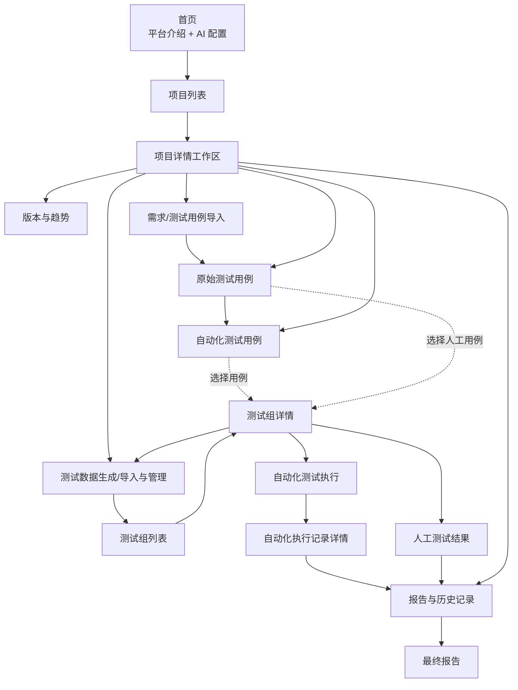

# v0.2.0 前端信息架构

本文用于指导 v0.2.0 前端页面骨架、路由和导航设计。重点是“页面之间如何组织”，不规定具体颜色、间距和组件样式。
具体页面布局和按钮清单见 [v0.2.0 前端页面与操作流程](v0.2.0-frontend-flow.md)。

## 1. 总体层级

平台采用三级结构：

```text
首页
└── 项目列表
    └── 项目详情（二级工作区）
        ├── 版本与趋势
        ├── 需求/测试用例导入
        ├── 原始测试用例
        ├── 自动化测试用例
        ├── 测试数据生成/导入与管理
        ├── 测试组
        │   └── 测试组详情（三级页面）
        ├── 自动化执行与结果
        │   ├── 自动化结果
        │   ├── 人工测试结果
        │   └── 最终报告
        └── 报告与历史记录
```

首页不承载项目数据。进入项目后，用户才看到版本、趋势和测试资产。

## 2. 页面关系图



## 3. 全局导航

### 3.1 首页导航

首页只提供平台级入口：

| 导航项 | 进入位置 | 说明 |
| --- | --- | --- |
| 开启平台 | 项目列表 | 用户完成 AI 配置或明确暂不使用后进入 |
| 项目列表 | 项目列表 | 直接进入项目管理 |
| AI 配置 | 首页右侧配置卡 | 配置模型服务、模型名称并测试连接 |

首页不提供以下导航：

- 趋势图；
- 运行记录列表；
- 测试组列表；
- v0.1.0 采集任务的详细管理入口。

### 3.2 项目列表导航

项目列表是所有项目工作的入口：

| 操作 | 目标 |
| --- | --- |
| 打开项目 | 项目详情工作区 |
| 新建项目 | 新建项目弹窗或独立表单 |
| 搜索/排序 | 当前项目列表，不离开页面 |
| 删除项目 | 删除确认流程 |

### 3.3 项目详情导航

项目详情是一个带二级页签的工作区。当前选中的项目和产品版本应持续显示在页面头部，避免用户忘记自己正在操作哪个项目。

推荐页签顺序：

```text
版本与趋势
  → 需求/测试用例导入
  → 原始测试用例
  → 自动化测试用例
  → 测试数据生成/导入与管理
  → 测试组
  → 自动化执行与结果
  → 人工测试结果
  → 报告与历史记录
```

页签不代表必须严格线性完成。用户可以直接打开已有资产；只有进入测试组执行或生成报告时，才由校验规则检查前置内容是否完整。

## 4. 项目详情工作区

### 4.1 版本与趋势

这是项目进入后的默认页签，包含：

- 产品版本列表；
- 新建产品版本；
- 当前项目趋势图；
- 版本对比入口。

趋势图属于项目详情，不属于首页。默认查看整个项目，用户可以按产品版本、模块、测试组或测试用例筛选。

### 4.2 需求/测试用例导入

这是 Beta 产品资料进入平台的入口。v0.2.0 不建立独立测试需求对象，因此页面名称可以使用“需求/测试用例导入”，但导入后主要形成原始测试用例。

页面内部顺序：

```text
选择文件
  → 选择导入目的
  → 核对字段映射
  → 预览数据
  → 导入原始测试用例
```

历史测试结果、测试记录、测试前备注、计划执行时间和附件是否导入，由用户在导入目的中选择。

### 4.3 原始测试用例

原始测试用例页保留用户的源数据，不被自动化转换覆盖。

页面主要操作：

- 按模块、测试项、优先级和软件版本筛选；
- 全选、取消全选和勾选用例；
- 进入用例详情；
- 生成自动化用例；
- 将勾选项带入测试组；
- 删除或重新导入源数据。

关闭浏览器或网站后，勾选清单仍保留在平台中。

### 4.4 自动化测试用例

自动化用例页是原始用例转换后的可编辑工作区。

页面主要操作：

- 查看来源用例编号并点击返回原始用例；
- 编辑自动化标题、输入、步骤和预期结果；
- 新增、删除和勾选自动化用例；
- 提交一条或多条修改给 AI；
- 校验当前表格；
- 将已勾选项带入测试组。

自动化编号由系统生成且不可修改。用户修改后必须重新校验；未校验的内容不能加入测试组或执行。

### 4.5 测试数据生成/导入与管理

这一页不是测试组执行页，而是管理“测试数据生成/导入任务”和数据包本身。用户需要先确认数据包符合平台标准格式，并查看数据实际情况，再把数据包带入测试组。

页面分为两个相邻区域或页签：

```text
生成数据
  → 选择 v0.1.0 采集任务和参数
  → 生成新的数据包

导入数据
  → 上传数据文件
  → 校验格式和内容
  → 保存为可选择数据包
```

页面需要展示：

- 数据包是否符合平台标准格式；
- 数据包的实际文件、通道、时间戳和数据完整性；
- 数据包属于正常数据还是某一种故障数据；
- 数据包来源于哪个 v0.1.0 生成/导入任务；
- 生成/导入任务的执行次数、状态和历史结果。

页面主要操作：

- 生成数据；
- 导入数据；
- 执行或重新执行数据生成/导入任务；
- 校验数据包；
- 查看数据包详情；
- 查看任务历史；
- 删除数据包或数据任务。

测试组中不提供未经校验的直接上传。测试组只能选择此页面已经生成或导入并通过校验的数据包。

### 4.6 测试组列表与测试组详情

测试组是选择完自动化用例和数据包之后的测试范围配置。逻辑顺序是：先有测试组，测试组编辑完成后，才执行自动化测试。

测试组列表主要操作：

- 按项目版本、测试组名称和状态筛选；
- 新建测试组；
- 打开测试组详情；
- 查看执行次数和最近记录；
- 隐藏、显示和删除测试组。

测试组详情负责编辑一次测试范围：

```text
测试组列表
  ├── 新建测试组
  ├── 搜索、排序、分页
  ├── 隐藏/显示测试组
  ├── 删除测试组
  └── 打开测试组详情

测试组详情
  ├── 添加/删除原始和自动化用例
  ├── 排序和查看用例
  ├── 选择和分配数据包
  ├── 执行自动化测试
  ├── 进入人工测试结果
  ├── 查看运行次数和记录
  └── 进入执行与结果工作区
```

新建测试组只填写最基本信息并带入当前勾选项，完整编辑在测试组详情完成。

### 4.7 自动化测试执行与结果工作区

“测试执行”不作为数据包管理页面，也不在测试组之前出现。它是测试组详情中的动作：测试组编辑完成后，点击“执行自动化测试”，才进入本工作区。

页面内部流程：

```text
选择执行模式
  → 执行前检查
  → 开始自动化测试
  → 刷新执行状态和结果
  → 查看自动化结果
  → 进入人工测试结果
  → 在同一工作区生成最终报告
```

页面主要操作：

- 开始执行；
- 刷新最新结果；
- 查看自动化执行记录；
- 查看自动化用例结果；
- 取消执行；
- 再次执行；
- 打开人工测试结果；
- 打开最终报告；
- 下载 HTML/纯文字报告。

自动化任务在执行后进入自动化执行流程。人工结果不混入自动化执行，而是从本工作区进入独立的人工测试结果页面。

最终报告不是额外的孤立流程末页，而是执行结果工作区中的一个结果页签：

```text
自动化结果 | 人工测试结果 | 最终报告
```

用户可以先刷新和查看自动化结果，再录入人工结果，最后切换到“最终报告”页签生成和下载报告。

### 4.8 人工测试结果

人工测试结果是独立页面，但从测试组详情或自动化执行与结果工作区进入；它不嵌入自动化执行流程，也不嵌入报告编辑页面。

进入后先选择项目、产品版本和测试组，再逐条填写结果。用户可以分多次保存，未填写项在最终报告中显示“未执行”。

人工测试结果页只显示当前测试组中的人工用例和混合用例，纯自动化用例不显示。

### 4.9 报告与历史记录

报告与历史记录页用于查找已经产生的结果，不替代执行结果工作区：

```text
测试记录
  → 查看自动化执行记录
  → 查看人工测试记录
  → 查看执行状态、结果和关键运行问题

最终报告
  → 选择一条自动化执行记录
  → 选择一条或多条人工测试记录
  → 生成最终报告
  → 下载 HTML/纯文字报告
```

报告生成只允许同一测试组、同一产品版本的记录进行合并。缺少自动化或人工记录时，另一部分显示未执行，不阻塞生成。

## 5. 返回、保存和过期规则

### 5.1 返回规则

- 从原始用例详情返回原始用例表时，保留筛选条件和勾选状态。
- 从自动化用例详情返回自动化用例表时，保留筛选条件、勾选状态和未提交修改提示。
- 从数据包详情返回测试数据页时，保留当前筛选条件。
- 从测试组详情进入人工测试或报告页后，返回时保留项目、版本和测试组上下文。
- 浏览器关闭后重新打开，已保存的勾选清单、测试组内容和人工草稿仍可恢复。

### 5.2 未保存修改规则

如果用户修改了自动化用例、测试组或人工结果但没有保存，离开页面时提示：

```text
当前有未保存修改，离开后将丢失这些修改。
[继续编辑] [保存并离开] [放弃修改]
```

如果只是勾选用例，勾选清单已经单独保存，不视为未保存修改。

### 5.3 报告过期规则

以下操作会让当前在线最终报告标记为“已过期”：

- 测试组用例发生变化；
- 测试组数据包关联发生变化；
- 自动化测试组再次执行；
- 人工测试结果被修改或删除。

报告不会自动改写。用户重新选择记录并点击“生成最终报告”后，才覆盖当前在线报告。

## 6. 页面级前置条件

| 页面 | 前置条件 |
| --- | --- |
| 项目列表 | 无 |
| 项目详情 | 已选择项目 |
| 产品版本 | 已选择项目；新建版本时不要求先导入用例 |
| 原始测试用例 | 已选择产品版本；可以为空 |
| 自动化测试用例 | 已有原始用例，或用户手动新增并填写来源编号 |
| 测试数据 | 可以先生成或导入数据；数据包必须通过校验才能被测试组使用 |
| 测试组详情 | 已创建测试组；创建时只需最基本信息 |
| 执行前检查 | 测试组中至少存在一个已校验的自动化用例 |
| 人工测试结果 | 已选择项目、产品版本和测试组 |
| 最终报告 | 至少选择一条自动化或人工测试记录 |
| 趋势分析 | 项目中至少有一份最终报告，否则显示暂无趋势数据 |

## 7. 版本边界

### v0.2.0

- 首页、项目列表和项目详情工作区；
- 产品版本管理；
- Beta 产品需求/测试用例导入；
- 原始测试用例和自动化测试用例表；
- AI 辅助转换及无 AI 时的低可信度规则转换；
- 数据包生成、导入、校验和选择；
- 测试组管理和数据驱动模拟执行；
- 独立人工测试结果页面；
- HTML/纯文字最终报告、趋势图和版本对比；
- GitHub Actions 对平台自身的固定样例验收。

### v0.3.0

- 更深入的需求结构化；
- 测试前风险分析；
- 自动化范围识别和用例推荐；
- 更完整的回归测试规划。

### v0.4.0

- 模拟设备状态机；
- ADB、HTTP、Shell 等模拟设备能力；
- 用例步骤驱动的模拟设备执行。

### 后续版本

- 真实被测设备连接；
- 设备发现、权限和现场环境管理；
- 企业级 CI/Jenkins 集成和正式质量门禁。
